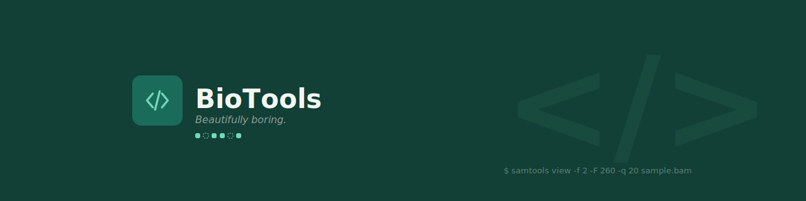

  

# BioTools

Build bioinformatics workflows the way researchers think, not the way command line tools are implemented.

## What it is

BioTools puts intuitive visual interfaces on top of the bioinformatics
software researchers already rely on, so they can learn, understand, and
confidently use those tools.

## Demo

## Why I'm building this

Anyone who has worked with alignment files has looked up what `99` means
at least once. Bitwise flags are compact and machine-friendly, and almost
nobody reads them fluently.

I hit this in a class using the Biostar Handbook, which was candid that
the flags are hard to decipher. The information isn't complicated — it's
just encoded in a format built for computers rather than people. BioTools
is my attempt to decode it on the reader's behalf.
