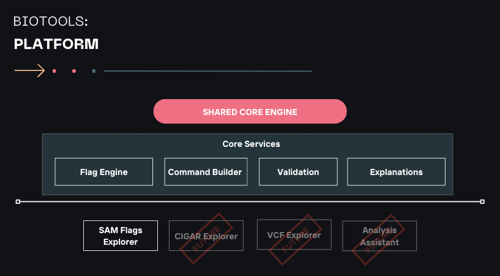
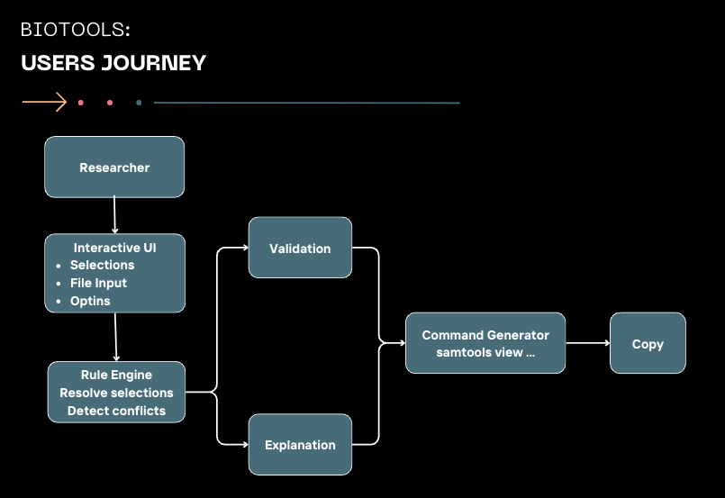
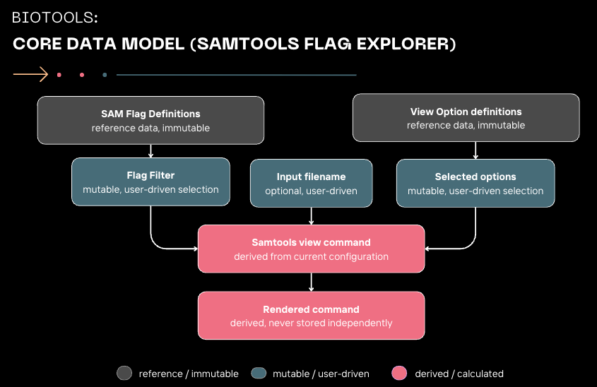
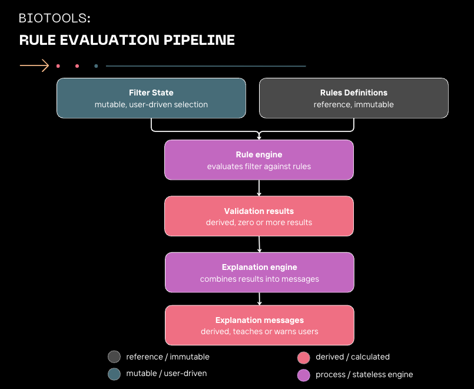
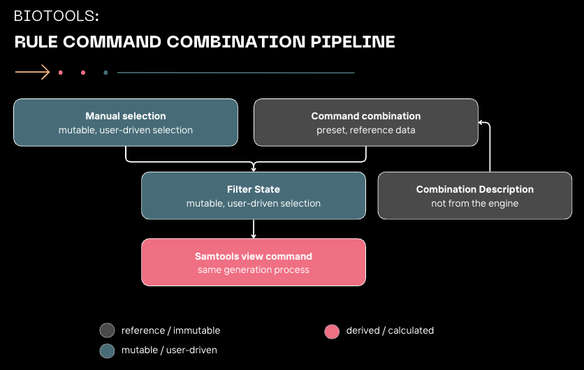

# BioTools Architecture

## Architectural Principles

- Single source of truth.
- Derived data is never stored independently.
- Reference data is immutable.
- Engines are stateless whenever possible.
- Explanations are separated from rule evaluation.
- Shared functionality should be reusable across applications when it naturally belongs in the platform core.
  
## Philosophy

BioTools is designed as a platform of educational bioinformatics applications.
Rather than replacing existing command line tools, BioTools helps researchers
understand, construct, and validate them.

---

## Platform Architecture

This diagram shows the shared services used across every BioTools application.

---

## User Journey

This illustrates how a researcher interacts with the platform from making
selections to generating a validated command.

---

## Core Data Model

The application maintains a single mutable Filter State.
Commands are always derived from that state and are never stored independently.

---

## Rule & Validation Pipeline

The Rule Engine evaluates the Filter State against immutable rule definitions.
Results are transformed into user-friendly explanations.

---

## Command Combination Pipeline

Preset command combinations and manual selections both produce the same
Filter State, ensuring a single command generation path.
